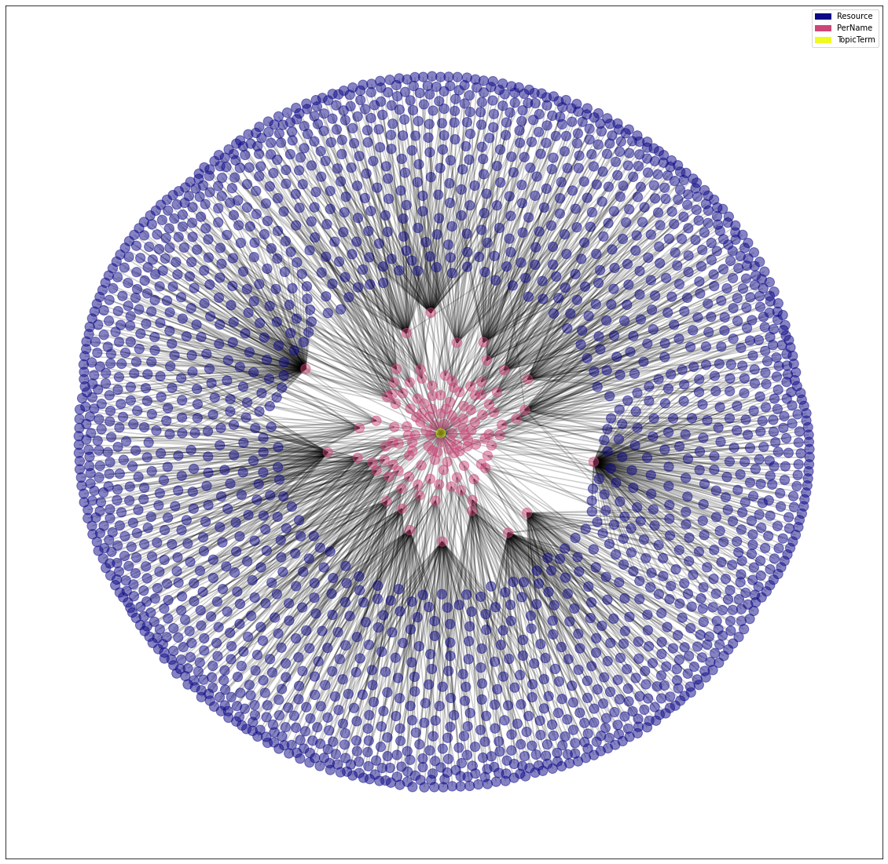
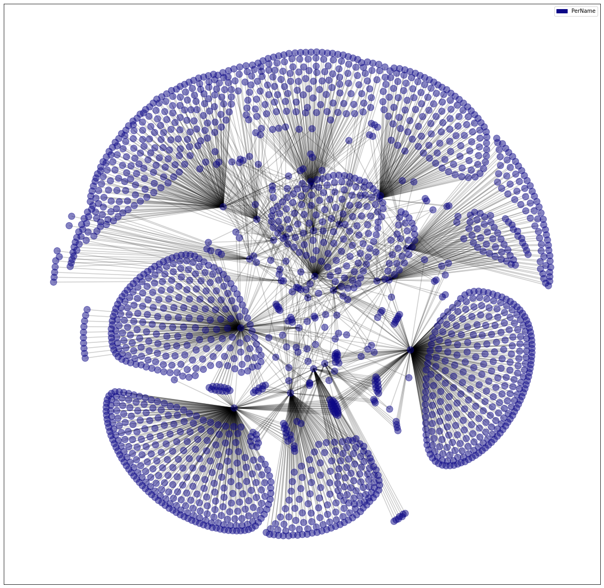
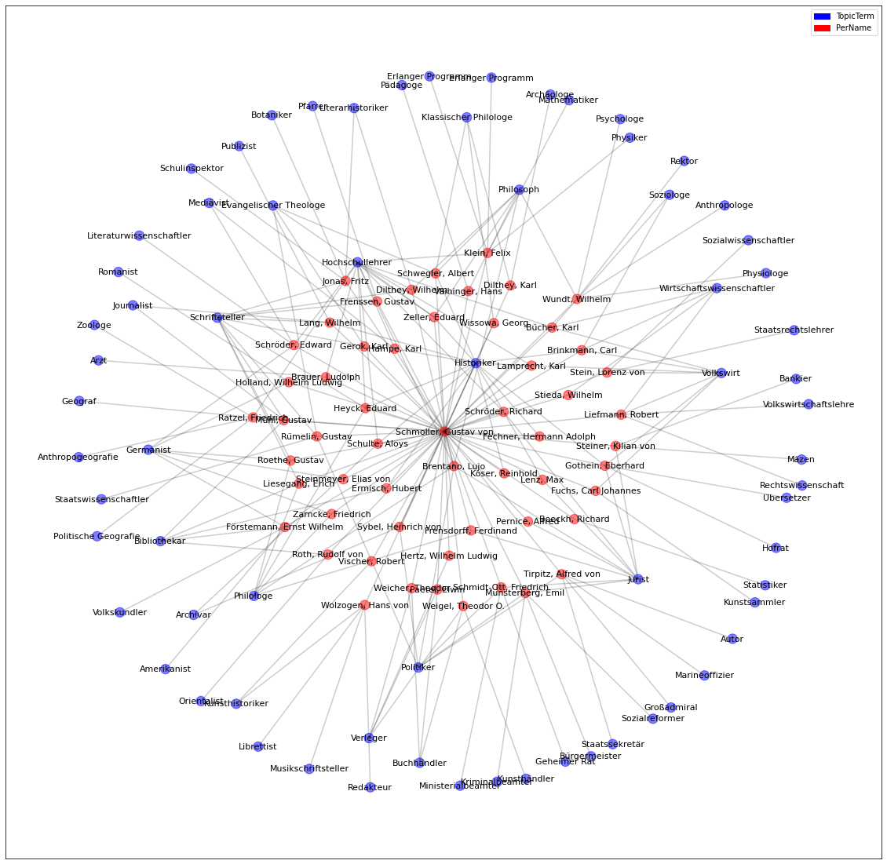
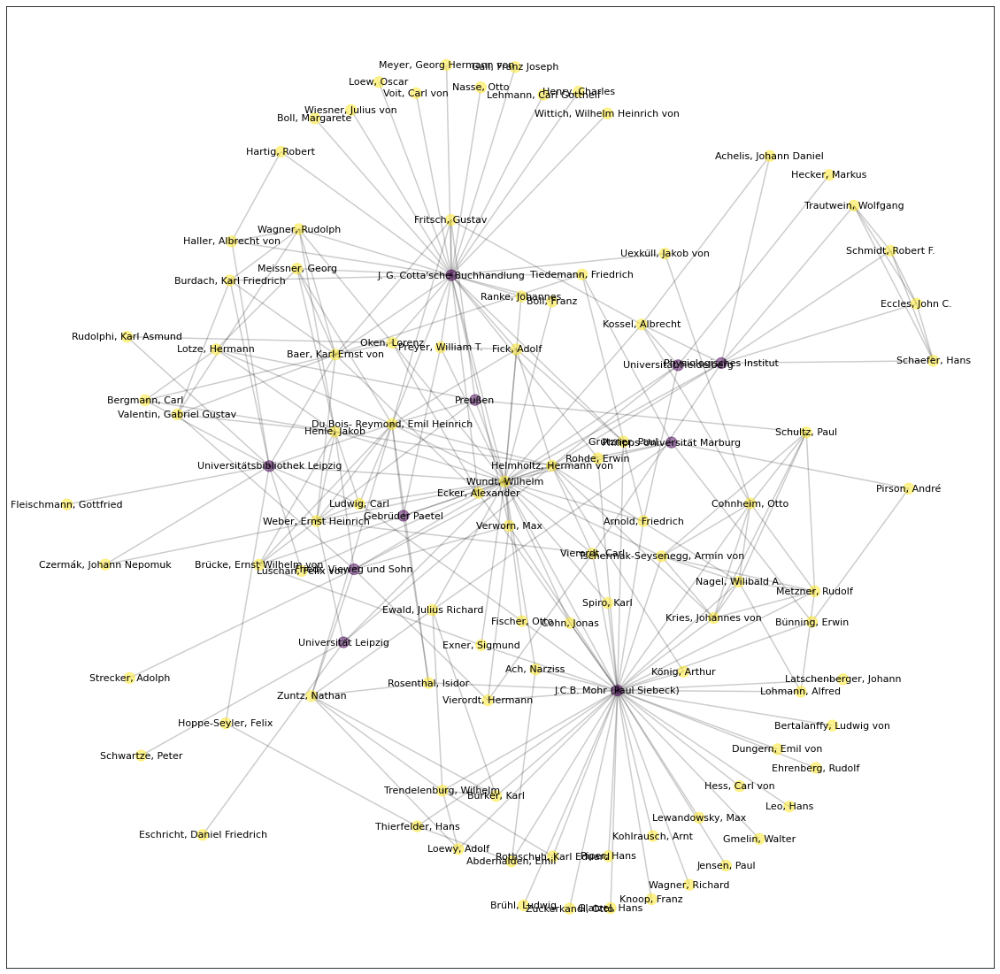

# SoNAR (IDH) - HNA Curriculum

**A hands-on introduction to digital methods for historical network analysis**

<div>




</div>

[](https://mybinder.org/v2/gh/sonar-idh/jupyter-curriculum/HEAD) [](https://www.jupyter.org/) [](https://creativecommons.org/licenses/by/4.0/) 


## About

This curriculum is an invitation to learn how to conduct historical network analysis on a large graph dataset using interactive Jupyter notebooks. The curriculum consists of five tutorials in the form of interactive notebooks that introduce the programming language Python, the graph database Neo4j and its query language Cypher. This curriculum was also created to provide a comprehensible introduction to using the SoNAR (IDH) database. 

[SoNAR (IDH)](https://sonar.fh-potsdam.de/) stands for Interfaces to Data for Historical Social Network Analysis and Research. The SoNAR (IDH) project examines and evaluates approaches to build and operate an advanced research technology environment supporting historical network analysis (HNA) and related research. Project partners from various fields – historiography, information visualization, artificial intelligence, computer sciences and information science – work on this topic from their respective perspectives.

## Overview

The curriculum consists of five notebooks, each covering different aspects relevant for conducting network analysis.

| Notebook | Content | Interactive Version | 
|----------|---------|-------------------|
|[1 - Jupyter and Python](https://nbviewer.jupyter.org/github/sonar-idh/jupyter-curriculum/blob/master/notebooks/Notebook%201%20-%20Jupyter%20and%20Python.ipynb) | Basic introduction to Python and Jupyter. Can be skipped in case you worked with Python before.| [](https://mybinder.org/v2/gh/sonar-idh/jupyter-curriculum/HEAD?filepath=%2Fnotebooks%2FNotebook%201%20-%20Jupyter%20and%20Python.ipynb)|
|[2 - Historical Network Analysis](https://nbviewer.jupyter.org/github/sonar-idh/jupyter-curriculum/blob/master/notebooks/Notebook%202%20-%20Historical%20Network%20Analysis.ipynb) | Basic introduction to graph theory and HNA. Example of network analysis based on a network of Nobel Laureates. |[](https://mybinder.org/v2/gh/sonar-idh/jupyter-curriculum/HEAD?filepath=%2Fnotebooks%2FNotebook%202%20-%20Historical%20Network%20Analysis.ipynb)|
|[3 - SoNAR (IDH)](https://nbviewer.jupyter.org/github/sonar-idh/jupyter-curriculum/blob/master/notebooks/Notebook%203%20-%20SoNAR%20%28IDH%29.ipynb) | How to access and query SoNAR (IDH) data. Introduction to Neo4j and Cypher. Examples of data exploration, descriptive analysis and complex queries. | [](https://mybinder.org/v2/gh/sonar-idh/jupyter-curriculum/HEAD?filepath=%2Fnotebooks%2FNotebook%203%20-%20SoNAR%20(IDH).ipynb)|
|[4 - History of Physiology](https://nbviewer.jupyter.org/github/sonar-idh/jupyter-curriculum/blob/master/notebooks/Notebook%204%20-%20Exploring%20the%20Network%20of%20Physiologists.ipynb) | Example case of analysing historical network of physiologists. Depiction of exploratory approach to HNA. | [](https://mybinder.org/v2/gh/sonar-idh/jupyter-curriculum/HEAD?filepath=%2Fnotebooks%2FNotebook%204%20-%20Exploring%20the%20Network%20of%20Physiologists.ipynb) |
|[5 - History of Economy](https://nbviewer.jupyter.org/github/sonar-idh/jupyter-curriculum/blob/master/notebooks/Notebook%205%20-%20Analyzing%20Gustav%20von%20Schmoller.ipynb) | Example case of analysing historial network of the economist Gustov von Schmoller. Depiction of a hypothesis based approach. | [](https://mybinder.org/v2/gh/sonar-idh/jupyter-curriculum/HEAD?filepath=%2Fnotebooks%2FNotebook%205%20-%20Analyzing%20Gustav%20von%20Schmoller.ipynb) |

## How to use the curriculum?

There are multiple ways to use this curriculum: 

1. **Static websites** 
   
   In the table above, you find links to *static* versions of each notebook in the first column. Use this way to access the notebooks in case you do not want to run code in an interactive environment but only want to read up the content of the notebooks. 

2. **Interactive Binder Versions**

    [The Binder Project](https://jupyter.org/binder) enables you to work with the notebooks of this curriculum in a cloud hosted interactive session. This way you can execute code and reproduce the contents of the notebooks. You also can write new code and do the exercises right in the notebooks - without installing anything on your computer. The respective links to the binder versions of the notebooks can be found in the table [above](#Content-of-the-Curriculum). 

    You can also open the full repository structure with binder by clicking on this button:
    [](https://mybinder.org/v2/gh/sonar-idh/jupyter-curriculum/HEAD)

3. **Interactive Local Versions**

    You also can check out this repository and build the docker container of the curriculum. This way you can manipulate the code completely to your liking and make the changes permanent. 

    To do so, you need to 1) clone this repository, 2) open the local directory, and 3) start the docker container - from the command line:
    
    ```
    git clone https://github.com/sonar-idh/jupyter-curriculum
    cd jupyter-curriculum
    docker-compose up
    ```

## Credits

The tutorials were created by Florian Richter in the context of the SoNAR (IDH) project with particular support from Mark-Jan Bludau, Kerstin Humm, Thorsten Halling, Eva Maria Holly and Marian Dörk.

The notebooks are released under the [Creative Commons Attribution license (CC BY 4.0)](https://creativecommons.org/licenses/by/4.0/).
